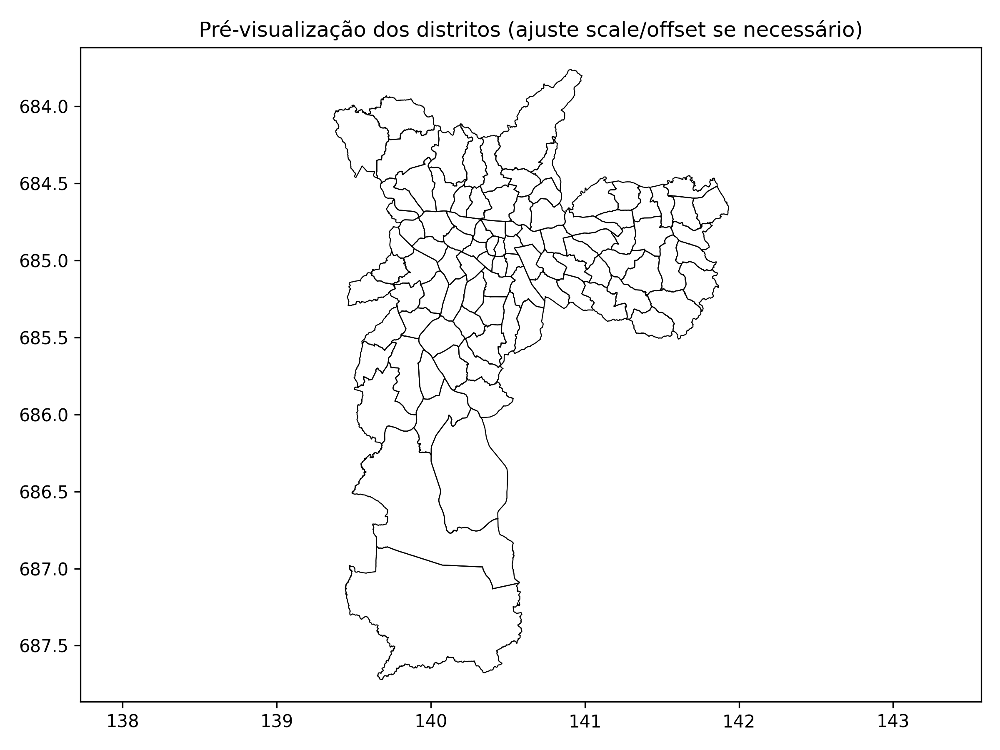

## 🏡 Real Estate RL Simulator 🏗️

O <strong>Real Estate RL Simulator</strong> é um ambiente gamificado desenvolvido para ensinar agentes de <strong>Reinforcement Learning (RL)</strong> a enriquecer investindo no mercado imobiliário. O ambiente simula um bairro fictício com <strong>100.000 imóveis</strong>, cada um com suas próprias características, como preço, metragem, renda média da região, taxa de criminalidade, IDH, demanda do mercado e infraestrutura urbana.

### 🎯 Objetivo do Agente

O agente começa com <strong>R$ 100.000</strong> e precisa alcançar <strong>R$ 1.000.000</strong> investindo em imóveis dentro do bairro simulado. Ele deve comprar barato, vender caro e administrar bem seu capital para atingir esse objetivo antes que o jogo termine.

### 📍 1. Estrutura do Bairro

O bairro será gerado aleatoriamente, contendo 100.000 moradias divididas entre casas e apartamentos. Cada imóvel tem uma série de características que afetam seu valor e sua taxa de valorização.

###### 📌 Tipos de Imóveis:

- Casas populares - Mais baratas, valorizam pouco.
- Apartamentos padrão - Preço médio, valorização moderada.
- Casas de luxo - Altíssimo preço, mas valorizam muito em certas áreas.
- Apartamentos de cobertura - Alto valor, mas sofrem forte influência de mercado.

###### 📌 Disposição Geográfica:

O bairro será um mapa gerado aleatoriamente com diferentes regiões, cada uma com seu perfil de valorização.
Algumas regiões têm alto potencial de crescimento, enquanto outras sofrem desvalorização devido a problemas estruturais.

###### 📌 Variáveis que Definem Cada Região do Bairro:

- Preço médio por metro quadrado
- Infraestrutura disponível (metrô, hospitais, escolas, shoppings)
- Qualidade da vizinhança (renda média, criminalidade, escolas)
- Conectividade e transporte (distância do centro, tempo de deslocamento)
- Oferta e demanda (estoque de imóveis à venda no bairro)
- Variação histórica de preços (se a região está valorizando ou desvalorizando)
- Taxa de ocupação (regiões muito vazias têm menor valorização)
- IDH da microrregião (influencia a demanda por moradia)
- Custo do condomínio (para apartamentos)
- Reformas e customizações (alguns imóveis permitem valorização por melhorias)

💡 Cada uma dessas variáveis será gerada aleatoriamente no início de cada nova simulação.

### 🎮 2. Regras do Jogo

O agente começa com R$ 100.000 e deve atingir R$ 1.000.000 o mais rápido possível.
Ele pode comprar, vender ou esperar a cada rodada.
Os preços dos imóveis flutuam a cada rodada, baseados em eventos do bairro e na situação econômica.

###### 📌 Eventos aleatórios podem ocorrer e impactar a valorização dos imóveis:
- Crise financeira → Preços caem em todas as regiões.
- Nova estação de metrô → Imóveis próximos valorizam.
- Novo shopping → Atração de moradores, aumentando demanda.
- Desastres naturais ou aumento da criminalidade → Queda na valorização de certas áreas.

### 🤖 3. Ações Disponíveis para o Agente

A cada rodada, o agente pode escolher uma entre três ações:

- Comprar um imóvel (se tiver dinheiro suficiente).
- Vender um imóvel (se já comprou e considera que o preço está bom).
- Esperar para analisar melhor o mercado antes de agir.

<strong>Nota:</strong> O agente pode comprar múltiplos imóveis e vender quando quiser, mas precisa administrar seu saldo.

📌 Se um imóvel permanecer muito tempo sem vender, pode perder valor por "desgaste de mercado".

### 📊 4. Estados (Observação do Agente)

📌 Cada estado do ambiente representa o mercado imobiliário no momento atual e contém informações como:

- Saldo disponível do agente
- Imóveis que ele já comprou e seus preços
- Listagem de imóveis disponíveis para compra (com todas as características descritas antes)
- Tendência de valorização do bairro (baseado em fatores como IDH, infraestrutura e demanda)
- Mudanças recentes no mercado (eventos que afetam os preços)

💡 O estado pode ser representado como um vetor numérico para facilitar o treinamento.

